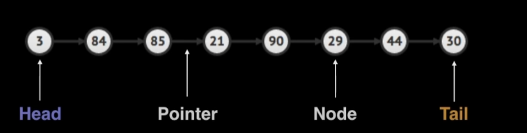
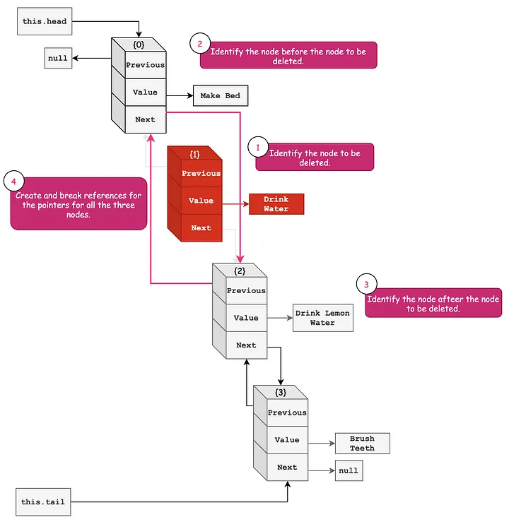

- [Big-O Notation](#big-o-notation)
  - [Constant Time:](#constant-time)
  - [Linear Time:](#linear-time)
  - [Logarithmic Time:](#logarithmic-time)
  - [Linearithmic Time:](#linearithmic-time)
  - [Quadratic Time:](#quadratic-time)
  - [Cubic Time:](#cubic-time)
  - [Exponential Time:](#exponential-time)
  - [Factorial Time:](#factorial-time)
- [Static and Dynamic Arrays](#static-and-dynamic-arrays)
  - [What is an Array?:](#what-is-an-array)
  - [When and where is a Array used?:](#when-and-where-is-a-array-used)
  - [Complexity:](#complexity)
  - [Static array usage example:](#static-array-usage-example)
  - [Dynamic Array implementation details:](#dynamic-array-implementation-details)
  - [Code Implementation:](#code-implementation)
- [Singly and Doubly Linked Lists](#singly-and-doubly-linked-lists)
  - [What is a linked list?:](#what-is-a-linked-list)
  - [Where are linked lists used:](#where-are-linked-lists-used)
  - [Terminology:](#terminology)
  - [Singly Linked vs. Doubly Linked:](#singly-linked-vs-doubly-linked)
  - [Implementation Details:](#implementation-details)
    - [How to insert new elements:](#how-to-insert-new-elements)
      - [Singly Linked List:](#singly-linked-list)
      - [Doubly Linked List:](#doubly-linked-list)
    - [How to remove elements:](#how-to-remove-elements)
      - [Singly Linked List](#singly-linked-list-1)
      - [Doubly Linked List](#doubly-linked-list-1)
  - [Complexity analysis:](#complexity-analysis)
  - [Basic Operations (Double linked list):](#basic-operations-double-linked-list)
    - [1. The pointers are represented using **this.next** and **this.previous** for each node.](#1-the-pointers-are-represented-using-thisnext-and-thisprevious-for-each-node)
    - [2. Both **head** and **tail** are pointing to the first node.](#2-both-head-and-tail-are-pointing-to-the-first-node)
    - [3. **Prepend** adding a node at the start of the linked list.](#3-prepend-adding-a-node-at-the-start-of-the-linked-list)
    - [4. **Append** adding a node at the end of the linked list.](#4-append-adding-a-node-at-the-end-of-the-linked-list)
    - [5. **Insert** insert a node at a given index.](#5-insert-insert-a-node-at-a-given-index)
    - [6. **Remove** delete a node at a given index.](#6-remove-delete-a-node-at-a-given-index)
  - [Code Implementation:](#code-implementation-1)

# Big-O Notation

> n - the size of the input  
> Complexity ordered in from smallest to largest
> 

> Let _f_ be a function that describes the running time of a particular algorithm for an input of size n:
>
> $$
> f(n) = 7log(n)^3 + 15n^2 + 2n^3 + 8
> $$
>
> $$
> O(f(n)) = O(n^3)
> $$

---

## Constant Time:

$$O(1)$$

- **Does not depend on $n$**

> Example 1:

```js
let i = 0;
while (i < 11) {
	i = i + 1;
}
```

> Example 2:

```js
a = 1;
b = 2;
c = a + 5 * b;
```

---

## Linear Time:

$$(O)n$$

> Example 1:

```js
let i = 0;
while (i < n) {
	i = i + 1;
}
```

$$f(n) = n$$
$$O(f(n)) = O(n)$$

> Example 2:

```js
let i = 0;
while (i < n) {
	i = i + 3;
}
```

$$f(n) = n/3$$
$$O(f(n)) = O(n)$$

---

## Logarithmic Time:

$$O(log(n))$$

> Example 1 (Binary Search):

```js
let low = 0;
let high = n - 1;

while (low <= high) {
	let mid = Math.floor((low + high) / 2);

	if (array[mid] === value) {
		return mid;
	} else if (array[mid] < value) {
		low = mid + 1;
	} else {
		high = mid - 1;
	}
}

return -1;
```

$$O(log^2(n)) = O(log(n))$$

> Example 2:

```js
let i = 0;
while (i < n) {
	let j = 0;
	while (j < 3 * n) {
		j = j + 1;
	}
	j = 0;
	while (j < 2 * n) {
		j = j + 1;
		i = i + 1;
	}
}
```

$$f(n) = n* (3n + 2n) = 5n^2$$
$$O(f(n)) = 0(n^2)$$

---

## Linearithmic Time:

$$O(log(n))$$

---

## Quadratic Time:

$$O(n^2)$$

> Example 1:

```js
for (let i = 0; i < n; i = i + 1) {
	for (let j = 0; j < n; j = j + 1)
}
```

- _n_ work done _n_ times is $n*n = O(n^2)$

$$f(n) = n*n = n^2$$
$$O(f(n))=O(n^2)$$

> Example 2:

```js
for (let i = 0; i < n; i = i + 1) {
	for (let j = i; j < n; j = j + 1)
}
```

- Replaced 0 with _i_
- Since $i$ goes from $[0,n]$ the amount of looping done is directly determined by what $i$ is.
- Remark that if $i=0$, we do $n$ work, if $i=1$, we do $n-1$ work, if $i=2$, we do $n-2$ work, etc...
- So the question then becomes what is :
  $$(n) + (n-1) + (n-2) + (n-3) + ... + 3 + 2 + 1$$
- Remarkably this turns out to be
  $$n(n+1)/2$$
- so,
  $$O(n(n+1)/2) = O(n^2/2 + n/2) = O(n^2)$$

---

## Cubic Time:

$$O(n^3)$$

---

## Exponential Time:

$$O(b^n), b > 1$$

---

## Factorial Time:

$$O(n!)$$

---

# Static and Dynamic Arrays

---

## What is an Array?:

> A static array is a fixed length container containing $n$ elements **indexable** from the range $[0, n-1]$
>
> > Q: What is meant by being 'indexable'?
> >
> > A: This means that each slot/index in the array can be referenced with a number

---

## When and where is a Array used?:

1. Storing and accessing sequential data
2. Temporarily storing objects
3. Used by Input Output routines as buffers
4. Lookup tables and inverse tables
5. Can be used to return multiple values from a function
6. Used in dynamic programming to cache answers to sub problems

---

## Complexity:

|  Arrays   | Static Array |     | Dynamic Array |
| :-------: | :----------: | --- | :-----------: |
|  Access   |    $O(1)$    |     |    $O(1)$     |
|  Search   |    $O(n)$    |     |    $O(n)$     |
| Insertion |     N/A      |     |    $O(n)$     |
| Appending |     N/A      |     |    $O(1)$     |
| Deletion  |     N/A      |     |    $O(n)$     |

---

## Static array usage example:

```js
let array = [44, 12, -5, 17, 6, 0, 3, 9, 100];
//			  0   1   2  3   4  5  6  7   8
array[0] = 44
array[1] = 12
array[4] = 6
array[7] = 9
array[9] => index out of bounds!
```

Elements in A are referenced by their index.
There is no other way to access elements in an array. Array indexing is zeo-based, meaning the first element is found in position zero.

---

## Dynamic Array implementation details:

- The dynamic array can grow and shrink in size

```js
let array = [34, 4];
// array.add(-7)
array = [34, 4, -7];
// array.add (34)
array = [34, 4, -7, 34];
//array.remove(4)
array = [34, -7, 34];
```

> Q: How can we implement a dynamic array?  
> A: One way is to use a static array!
>
> > 1. Create a static array with an initial capacity
> > 2. Add elements to the underlying static array, keeping track of the number of elements.
> > 3. If adding another element will exceed the capacity, then create a new static array with twice the capacity and copy the original elements into it.


## Code Implementation:

```js
class DynamicArray {
	constructor(capacity = 16) {
		if (capacity < 0) throw new Error('Illegal Capacity: ' + capacity);
		this.arr = new Array(capacity);
		this.len = 0;
		this.capacity = capacity;
	}
	// The 'size' method returns the current number of elements in the array.
	size() {
		return this.len;
	}
	// The 'isEmpty' method checks if the array is empty by checking if the size is zero.
	isEmpty() {
		return this.size() === 0;
	}
	// The 'get' method returns the element at a specific index in the array.
	get(index) {
		return this.arr[index];
	}
	// The 'set' method sets the element at a specific index in the array.
	set(index, elem) {
		this.arr[index] = elem;
	}
	// The 'clear' method removes all elements from the array by setting them to null.
	clear() {
		for (let i = 0; i < this.len; i++) {
			this.arr[i] = null;
		}
		this.len = 0;
	}
	// The 'add' method adds an element to the array. If the array is already full, it doubles the capacity by creating a new array and copying the existing elements into it.
	add(elem) {
		if (this.len + 1 >= this.capacity) {
			if (this.capacity === 0) {
				this.capacity = 1;
			} else {
				this.capacity *= 2;
			}
			const new_arr = new Array(this.capacity);
			for (let i = 0; i < this.len; i++) {
				new_arr[i] = this.arr[i];
			}
			this.arr = new_arr;
		}
		this.arr[this.len++] = elem;
	}
	// The 'removeAt' method removes an element at a specified index from the array. It shifts the remaining elements to fill the gap.
	removeAt(rm_index) {
		if (rm_index >= this.len || rm_index < 0) throw new Error('IndexOutOfBoundsException');
		const data = this.arr[rm_index];
		const new_arr = new Array(this.len - 1);
		for (let i = 0, j = 0; i < this.len; i++, j++) {
			if (i === rm_index) {
				j--; // Skip over rm_index by fixing j temporarily
			} else {
				new_arr[j] = this.arr[i];
			}
		}
		this.arr = new_arr;
		this.capacity = --this.len;
		return data;
	}
	// The 'remove' method removes the first occurrence of a specified object from the array by finding its index and calling removeAt method.
	remove(obj) {
		const index = this.indexOf(obj);
		if (index === -1) return false;
		this.removeAt(index);
		return true;
	}
	// The 'indexOf' method returns the index of the first occurrence of a specified object in the array. It compares the objects using the equals method (if available) or strict equality (===).
	indexOf(obj) {
		for (let i = 0; i < this.len; i++) {
			if (obj === null) {
				if (this.arr[i] === null) return i;
			} else {
				if (obj.equals(this.arr[i])) return i;
			}
		}
		return -1;
	}
	// The 'contains' method checks if the array contains a specified object by calling the 'indexOf' method and checking if the returned index is not -1.
	contains(obj) {
		return this.indexOf(obj) !== -1;
	}
	// This code defines a special method called [Symbol.iterator] using the * symbol, indicating that it's a generator function. It allows us to create an iterator for an object. In simpler terms, it enables us to loop over the object and retrieve its values one by one.

	// Inside the iterator function:

	// It initializes a variable called index to 0.
	// It enters a while loop that continues as long as index is less than the length of the array.
	// In each iteration, it uses the yield keyword to pause the execution and return the value at the current index of the array (this.arr[index]).
	// After yielding the value, it increments index by 1 to move to the next element in the array.
	// This process repeats until it has yielded all the values in the array.
	*[Symbol.iterator]() {
		let index = 0;
		while (index < this.len) {
			yield this.arr[index];
			index++;
		}
	}
	// This code defines a toString method, which is a common method available in many JavaScript objects. It converts the object to a string representation.

	// Inside the toString method:

	// It first checks if the length of the array (this.len) is equal to 0. If so, it returns an empty string ("[]").
	// If the length is not 0, it proceeds to create a string representation of the array.
	// It initializes a variable called result to "[" to denote the beginning of the array.
	// Then, it enters a for loop that iterates over the array from the first element to the second-to-last element (i < this.len - 1).
	// In each iteration, it appends the value at the current index (this.arr[i]) followed by a comma and a space to the result string.
	// After the loop, it appends the last element of the array (this.arr[this.len - 1]) followed by "]" to close the array.
	// Finally, it returns the resulting string representation of the array.
	toString() {
		if (this.len === 0) return '[]';
		else {
			let result = '[';
			for (let i = 0; i < this.len - 1; i++) {
				result += this.arr[i] + ', ';
			}
			result += this.arr[this.len - 1] + ']';
			return result;
		}
	}
}
```

---

# Singly and Doubly Linked Lists

## What is a linked list?:

- A linked list is a sequential list of nodes that hold data which point to other nodes also containing data

```js
Head -> Node1 -> Node2 -> Node3 -> ... -> Tail -> null
//In a linked list, each node contains two components: data and a pointer to the next node in the list.
//The Head represents the starting point or the first node of the linked list, while the Tail represents the end or the last node of the linked list.
//The arrow (->) indicates the direction of traversal from one node to the next.
```

---

## Where are linked lists used:

1. Used in many List, Queue & Stack implementations.
2. Great for creating circular lists.
3. Can easily model real world objects such as trains.
4. Use in separate chaining, which is present certain Hashtable implementations to deal with hashing collisions.
5. Often used in the implementation of adjacency lists for graphs

---

## Terminology:

- **Head:** The first node in a linked list
- **Tail:** The last node in a linked list
- **Pointer:** Reference to another node
- **Node:** An object containing data and pointer(s)
  

---

## Singly Linked vs. Doubly Linked:

- Singly linked list only hold a reference to the next node. In the implementation you always maintain a reference to the **head** to the linked list and a reference to the **tail** node for quick additions/removals
  
- A doubly linked list each node holds a reference to the next and previous node. In The implementation you always maintain a reference to the **head** and the **tail** of the doubly linked list to do quick additions/removals from both ends of your list
  

  |     Lists     |                   Pros                    |     |                  Cons                  |
  | :-----------: | :---------------------------------------: | --- | :------------------------------------: |
  | Singly Linked | Uses Less memory & Simpler implementation |     | Cannot easily access previous elements |
  | Doubly Linked |        Can be traversed backwards         |     |            Takes 2x memory             |

---

## Implementation Details:

### How to insert new elements:

#### Singly Linked List:

> 
>
> 1. Create new pointer (points to head)
> 2. Seek ahead (23)
> 3. Create new node (11)
> 4. New node point to (7)
> 5. Node (23) points to new node (11)

#### Doubly Linked List:

> 
>
> 1. Create traverser pointer (points to head)
> 2. Advance just before insertion position (23)
> 3. Create new node (11)
> 4. New node pointer to (7)
> 5. New node (7) pointer to (23)
> 6. (23) pointer to (11)

---

### How to remove elements:

#### Singly Linked List

> 
>
> 1. Create 2 pointers trav1 points to head trav2 points to heads next node
> 2. Advance trav2 until we find node to remove while also advancing trav1
> 3. Create another pointer for node to remove
> 4. Advance trav2 to next node
> 5. Set trav1's next pointer equal to trav2

#### Doubly Linked List

> ## 
>
> 1. Create traverser point on head
> 2. Seek until desired node is pointed at
> 3. Remove (9) by setting (4)'s pointer = to (15) [vise versa]

## Complexity analysis:

|                | Singly Linked |     | Doubly Linked |
| :------------: | :-----------: | --- | :-----------: |
|     Search     |    $0(n)$     |     |    $0(n)$     |
| Insert at head |    $0(1)$     |     |    $0(1)$     |
| Insert at tail |    $0(1)$     |     |    $0(1)$     |

|                  | Singly Linked |     | Doubly Linked |
| :--------------: | :-----------: | --- | :-----------: |
|  Remove at head  |    $0(1)$     |     |    $0(1)$     |
|  Remove at tail  |    $0(n)$     |     |    $0(1)$     |
| Remove at middle |    $0(n)$     |     |    $0(n)$     |

---

## Basic Operations (Double linked list):

### 1. The pointers are represented using **this.next** and **this.previous** for each node.

```js
//defines a Node class for a doubly linked list
class Node {
	constructor(value) {
		this.value = value;
		this.previous = null;
		this.next = null;
	}
}
```

### 2. Both **head** and **tail** are pointing to the first node.

```js
const morningRoutine = {
	value: 'Drink Water',
	previous: null,
	next: null,
};
```

### 3. **Prepend** adding a node at the start of the linked list.

- Create a new node **Make Bed**. The **previous** and **next** pointers will be pointer to **null** for now.
- The **this.head** will point to the new node.
- No change for **this.tail**. It will point to the current node that is **Drink Water**.
- The pointer **next** for the new node will point to the node **Drink Water**.
- The pointer previous for the node **Drink Water** will point to the new node.


```js
prepend('Make Bed');

const morningRoutine = {
	value: 'Make Bed',
	previous: null,
	next: {
		value: 'Drink Water',
		previous: '<REFERENCE TO NODE MAKE BED>',
		next: null,
	},
};
```

### 4. **Append** adding a node at the end of the linked list.

This is the straightforward operation where we change the reference for **this.tail**, **previous**, and **next** for the nodes. The time complexity for this operation is O(1).

- Create a new node **Brush Teeth**.
- The **this.tail** will point to the new node.
- The pointer **next** for the node **Drink Water** will point to the new node Brush Teeth.
- The pointer **previous** of the new node will point to the previous node **Drink Water**.


```js
append('Brush Teeth');

const morningRoutine = {
	value: 'Make Bed',
	previous: null,
	next: {
		value: 'Drink Water',
		previous: '<REFERENCE TO NODE MAKE BED>',
		next: {
			value: 'Brush Teeth',
			previous: '<REFERENCE TO NODE DRINK WATER>',
			next: null,
		},
	},
};
```

### 5. **Insert** insert a node at a given index.

- Create a new node **Drink Lemon Water**.
- Traverse to the index 2 and keep the reference for the node **Drink Water** and **Brush Teeth**.
- Point **next** of the **Drink Water** node to the new node.
- Point **previous** of the new node back to the node **Drink Water**.
- Point **next** of the new node to the node Brush Teeth.
- Point **previous** of the node **Brush Teeth** to the new node.


```js
insert('Drink Lemon Water', 2);

const morningRoutine = {
	value: 'Make Bed',
	previous: null,
	next: {
		value: 'Drink Water',
		previous: '<REFERENCE TO THE NODE MAKE BED>',
		next: {
			value: 'Drink Lemon Water',
			previous: '<REFERENCE TO THE NODE DRINK WATER>',
			next: {
				value: 'Brush Teeth',
				previous: '<REFERENCE TO THE NODE DRINK LEMON WATER>',
				next: null,
			},
		},
	},
};
```

### 6. **Remove** delete a node at a given index.

- Traverse to the node that is before the node to be deleted - **previousNode**.
- Identify the node after the node to be deleted - **nextNode**.
- Point the **next** pointer of the node **previousNode** to the nextNode node.
- Point the **previous** pointer of the node **previousNode** to the **previousNode**.



```js
delete ('Drink Water', 1);

const morningRoutine = {
	value: 'Make Bed',
	previous: null,
	next: {
		value: 'Drink Lemon Water',
		previous: `<REFERENCE TO NODE MAKE BED>`,
		next: {
			value: 'Brush Teeth',
			previous: `<REFERENCE TO NODE DRINK LEMON WATER>`,
			next: null,
		},
	},
};
```

---

## Code Implementation:

```js
class Node {
	constructor(value) {
		this.value = value;
		this.next = null;
		this.previous = null;
	}
}

class DoublyLinkedList {
	constructor(value) {
		this.head = {
			value: value,
			next: null,
			previous: null,
		};
		this.length = 1;
		this.tail = this.head;
	}

	printList() {
		let array = [];
		let currentList = this.head;
		while (currentList !== null) {
			array.push(currentList.value);
			currentList = currentList.next;
		}

		console.log(array.join(' <--> '));
		return this;
	}

	// Insert node at end of the list
	append(value) {
		let newNode = new Node(value);

		this.tail.next = newNode;
		newNode.previous = this.tail;
		this.tail = newNode;

		this.length++;
		this.printList();
	}

	// Insert node at the start of the list
	prepend(value) {
		let newNode = new Node(value);

		newNode.next = this.head;
		this.head.previous = newNode;
		this.head = newNode;

		this.length++;
		this.printList();
	}

	// Insert node at a given index
	insert(index, value) {
		if (!Number.isInteger(index) || index < 0 || index > this.length + 1) {
			console.log(`Invalid index. Current length is ${this.length}.`);
			return this;
		}

		// If index is 0, prepend
		if (index === 0) {
			this.prepend(value);
			return this;
		}

		// If index is equal to this.length, append
		if (index === this.length) {
			this.append(value);
			return this;
		}

		// Reach the node at that index
		let newNode = new Node(value);
		let previousNode = this.head;

		for (let k = 0; k < index - 1; k++) {
			previousNode = previousNode.next;
		}

		let nextNode = previousNode.next;

		newNode.next = nextNode;
		previousNode.next = newNode;
		newNode.previous = previousNode;
		nextNode.previous = newNode;

		this.length++;
		this.printList();
	}

	// Remove a node
	remove(index) {
		if (!Number.isInteger(index) || index < 0 || index > this.length) {
			console.log(`Invalid index. Current length is ${this.length}.`);
			return this;
		}

		// Remove head
		if (index === 0) {
			this.head = this.head.next;
			this.head.previous = null;

			this.length--;
			this.printList();
			return this;
		}

		// Remove tail
		if (index === this.length - 1) {
			this.tail = this.tail.previous;
			this.tail.next = null;

			this.length--;
			this.printList();
			return this;
		}

		// Remove node at an index
		let previousNode = this.head;

		for (let k = 0; k < index - 1; k++) {
			previousNode = previousNode.next;
		}
		let deleteNode = previousNode.next;
		let nextNode = deleteNode.next;

		previousNode.next = nextNode;
		nextNode.previous = previousNode;

		this.length--;
		this.printList();
		return this;
	}
}

let myDoublyList = new DoublyLinkedList(10);

myDoublyList.append(5); // 10 <--> 5

myDoublyList.append(16); // 10 <--> 5 <--> 16

myDoublyList.prepend(1); // 1 <--> 10 <--> 5 <--> 16

myDoublyList.insert(2, 99); // 1 <--> 10 <--> 99 <--> 5 <--> 16
myDoublyList.insert(20, 88); // Invalid index. Current length is 5.
myDoublyList.insert(5, 80); // 1 <--> 10 <--> 99 <--> 5 <--> 16 <--> 80
myDoublyList.insert(0, 80); // 80 <--> 1 <--> 10 <--> 99 <--> 5 <--> 16 <--> 80

myDoublyList.remove(0); // 1 <--> 10 <--> 99 <--> 5 <--> 16 <--> 80
myDoublyList.remove(5); // 1 <--> 10 <--> 99 <--> 5 <--> 16
myDoublyList.remove(2); // 1 <--> 10 <--> 5 <--> 16
```

<!-- [Link to more info in this readme.md](readme.md) -->
